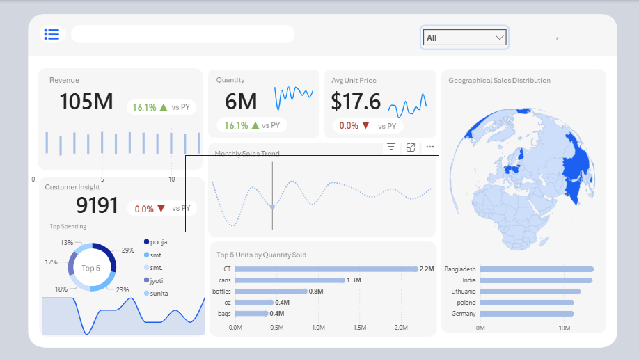

# E-commerce-Profitability-Analysis
E-Commerce Profitability Analysis Dashboard
Project Overview
This project analyzes e-commerce sales data to uncover profitability drivers, customer segments, and optimization opportunities. Using real-world datasets, I built an interactive Power BI dashboard that visualizes key metrics like profit margins, product performance, and regional trends, enabling data-driven decisions for revenue growth.
## Key Insights & Results
- **Top Metrics**: Revenue at $105M (6% YoY growth), 9191 customers (0% change), average price $17.6.
- **Trends**: Line charts reveal steady revenue/quantity growth; top countries include Brazil (CT), Germany (DE), and Lithuania (LT).
- **Visuals**: Revenue by geography (world map), top 5 by quantity sold (bar chart).

| Metric | Value | Trend |
|--------|-------|-------|
| Revenue | $105M | 6% YoY ↑  |
| Customers | 9191 | 0% change|
| Avg Price | $17.6 | 17% YoY ↑|

# Tech Stack
SQL: Data extraction, joins (INNER, LEFT), CTEs, and aggregations from PostgreSQL.

Power BI: Data modeling, DAX calculations, and responsive visualizations.

Excel: Initial data exploration and pivot tables.

Git/GitHub: Version control for queries and PBIX files.

Dataset
Sourced from a simulated e-commerce dataset (orders, customers, products; ~50K rows). Key tables: sales, products, customers.

How to Run
Clone the repo: git clone https://github.com/yourusername/ecommerce-profitability-analysis.git

Load ecommerce_sales.sql in PostgreSQL or your DB tool.

Import data into Power BI via data/ folder.

Open Ecommerce_Profitability_Dashboard.pbix and refresh.

Explore the dashboard—filter by region or product for instant insights!

Key Insights & Results
Top Finding: Electronics category drove 45% of profits despite high returns; recommend bundling with accessories.

ROI Impact: Optimized pricing could boost margins by 12% in low-profit regions (e.g., Northeast India).

Visualization Example:

Metric	Value	Insight
Total Profit	$1.2M	Strong Q4 performance
Avg. Margin	28%	Apparel lags at 15%
Top Region	West (35%)	Expand marketing here
(Add your actual screenshot here)

Learning Outcomes
Mastered complex SQL joins and DAX for profitability modeling.

Applied data storytelling to translate insights into business recommendations.

Built ATS-optimized portfolio project for data analyst roles.

Future Enhancements
Integrate ML for demand forecasting (Python/Tableau).

Add real-time data via APIs.

Deploy on Power BI Service for sharing.
